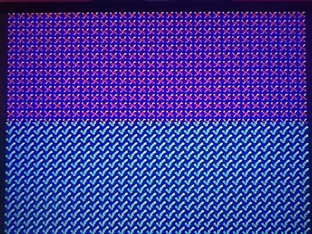

93143 - Writing to VRAM during HBlank
=====================================

Posted [on the NESDev forum][p]:

[p]: https://forums.nesdev.com/viewtopic.php?p=248408#p248408

> I've used all 8 HDMA channels to force blank, write the VRAM address, transfer
> 20 bytes of data, and turn the screen back on. It appears to work as well as
> could reasonably be expected.
> 
> I have not stress-tested it with regular DMA to work out what the ultimate
> limits are, what with map and tile prefetch needing to happen before line
> drawing starts. I should test this.
> 
> As we've seen in other experiments, the SNES may become violent when confused.
> On my SNES, the sprite layer on the line following the data burst not only
> doesn't work properly (which was expected), it shows white flickering segments
> despite white being nowhere in the palette. However, turning off sprites with
> TM/TS ($212C/$212D) removes the artifacting.
> 
> Unfortunately, writing the VRAM address during active display (so as to save
> time during HBlank) seems to have weird results (black lines across the tile,
> implying a nonzero index corresponding to a colour I didn't specify...?). I
> haven't gone to great lengths to figure out why this happens. It's possible I
> screwed something up... However, it does appear that once properly
> established, the VRAM address carries over between HBlanks, and that VRAM is
> open for data pretty much immediately after force blank is set.
> 
> The [attachment][hvdma] shows a BG layer repeating a single tile composed
> of data with only one nonzero bitplane (the highlights indicate >16 bytes
> transferred), with a blue background composed of 64x64 sprites. The change in
> the tile pattern halfway down the screen is due to the tile being overwritten
> by HDMA.

[hvdma]: ./hvdma.sfc

The output should look like this:

93143 later posted a followup:

> [This test][hvdma_max] triggers a DMA (consisting of a write to INIDISP, the
> data shot to VMDATAH*, and another write to INIDISP) in an H-IRQ (using a
> cycle-counted jump table to line up the DMA trigger write to a particular dot
> regardless of main code max instruction length) in order to determine whether
> the active layer wakes up in time given a particular data length. I tried all
> the 4bpp layers in Mode 1, 2, and 3, and apparently BG1 in Mode 1 loads the
> latest and thus allows the longest blanking.
> 
> If you want to mess with it, the length of the data shot ($1D) is at $80F9 in
> the file. Note that it is impossible to get DMA aligned to within a single dot
> even if the code that triggers it is, so the result will not necessarily be
> the same on every line once the glitching starts.
> 
> It doesn't look as interesting this time; I didn't use complex graphics. Just
> green. The point was not to show that the data goes into VRAM; we already know
> that from last time. It was to figure out how long the data burst can take
> before force blank is released too late.
> 
> * Odd-sized transfers are not compatible with word writes to VMDATAL/H. One
> could, however, upload even and odd bytes in separate transfers to VMDATAL and
> VMDATAH, in which case the HBlank DMA might only need to target one of them,
> with the other handled entirely in VBlank. I tried writing to VMDATAL instead
> of VMDATAH, but it didn't improve the maximum transfer size.

[hvdma_max]: ./hvdma_max.sfc
